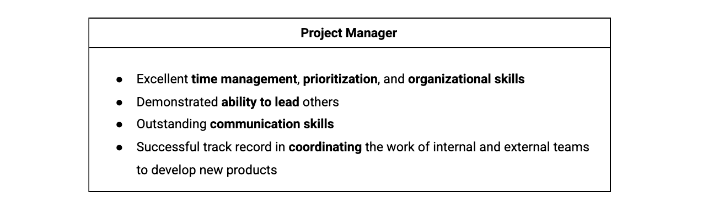
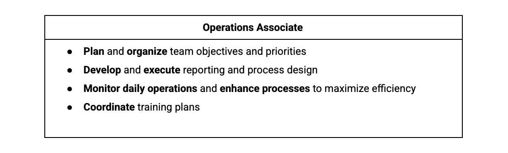

# Embarking on a career in project management
You will learn how the program is structured, what project management is and what a project manager does, how to apply your skills from previous work experience to project management roles, what types of project management roles you could pursue after completing this certificate, and how to search for those positions.

## Project Management
- Project management involves the application of knowledge, skills, tools, and techniques to meet project requirements and achieve desired outcomes.
- It is crucial for ensuring that projects deliver expected outcomes within established timeframes and budgets. Project management involves careful planning, task organization, and budgeting to successfully implement initiatives.
- Effective project management essential for organizational success, with poor management leading to significant financial and temporal losses. 
- The role of program managers is the responsibility for overseeing multiple projects aligned with the company's goals.
- The importance of project management in planning, organizing, managing tasks, and controlling costs.

## Role of a Project Manager
- Project managers play a crucial role in ensuring the successful execution of projects within organizations.
- Their day-to-day activities typically involve following a structured process that includes planning, organizing, task management, budgeting, and cost control. 
- The overarching goal is to ensure that projects are completed on time and within budget.
- Beyond these foundational tasks, project managers are responsible for ensuring that the project outcomes bring value to the company.
- This can involve creating new services for customers, adapting existing services to better meet customer needs, or undertaking various tasks that contribute to the overall success and value of the project. 
- The specific responsibilities of a project manager can vary based on the nature of the project, the industry, and the company. 
- Whether it's overseeing the construction of a new building, managing a renewable energy product in a startup, or establishing an event management company, the daily tasks of a project manager are diverse and tailored to the unique requirements of each project.

## Project management job categories and common roles 
### Introductory-level project management roles
Entry-level project management positions are a great opportunity to get your foot in the door and learn the ins and outs of how a company operates and manages projects. The lessons you learn from these experiences are extremely valuable to your growth in project management. Some entry-level project management positions include:

- **Junior Project Manager**: Performs all aspects of being a project manager alongside a more experienced professional.
- **Project Administrator**: Assists the rest of the project team with administrative tasks. 
- **Project/Program Assistant**: Supports team members working on a project and offers administrative support. May perform research or create training documents along with other jobs as assigned by program leaders.
- **Project/Program Coordinator**: Participates in hands-on project work and administrative tasks. Works under a project manager to make sure projects are completed on time and within budget.
- **Project Support Specialist**: Works alongside a project manager and team members to oversee assigned projects. May also be responsible for training and developing employees to perform designated tasks.

### Traditional project management roles
Once you have gained some experience in introductory-level positions, you can explore traditional project management roles, such as:

- **Project Manager**: Responsible for the initiating, planning, executing, monitoring, and closing of a project. Includes industry-specific titles like IT project manager, construction project manager, or engineering project manager, which utilize skills that are transferable among industries.
- **Project Analyst**: Moves a project along by sharing information, providing support through data analysis, and contributing to strategy and performance. 
- **Project Leader/Director**: Drives core decision-making and sets the direction for the project. Usually knowledgeable about the product or deliverable. 
- **Project Controller**: Primarily responsible for project planning. You are likely to see this job title in industries like engineering and construction.
- **Technical Project Manager**: Conducts project planning and management for identified goals within a company. Ensures that projects are completed to the requirements within a defined time frame and budget.
- **Project Management Office (PMO) Analyst**: Manages the progress of complex projects to ensure timely execution and completion. 

### Program and portfolio management roles
As you have learned, project managers are responsible for the day-to-day management of projects. They shepherd projects from start to finish and serve as a guide for their team. Project managers must apply the right tools, techniques, and processes to complete the project successfully, on time, and within budget. 

After you have carried out projects successfully and feel you are ready for a step up in responsibility, a program manager position may be the next step for you. While a project is one single-focused endeavor, a program is a collection of projects. Program managers are responsible for managing many projects. At Google, all project managers are called program managers because they manage multiple projects simultaneously. 

Successfully implementing programs as a program manager can eventually make you a great fit for more senior positions, such as a senior program manager or a portfolio manager. A portfolio is a collection of projects and programs across an entire organization. Portfolio managers are responsible for portfolios of projects or programs for one client. Over the course of your career, you might progress from project manager to program manager to portfolio manager roles.

While project, program, and portfolio managers hold different types and levels of responsibility, they are all project managers.
- **Program managers**: Manage a group of projects that are related or similar to one another and handle the coordination of these projects. They facilitate effective communication between individual project managers and provide support where necessary. They also help create and manage long-term goals for their organization.
- **Portfolio managers**: Responsible for managing a group of related programs within the same organization. They coordinate various programs in order to ensure they are on track and that the organization is meeting its strategic initiatives. Portfolio managers look at all projects and programs within the organization and prioritize work as necessary. 

### Operational management roles 
In operational management roles, you will get the opportunity to experience several different departments and how they interact and operate. Operational management roles allow you to work alongside peers and management from various business segments, giving you an appreciation for what each segment does on a daily basis. Key elements of project management include making sure a project is on budget and on schedule. Some operational management positions include:
- **Operations Analyst**: Manages and coordinates research, investigates workflows, creates business procedures, and recommends changes to improve the project and company. 
- **Operations Manager**: Oversees strategic decision-making and rolls out plans of action based on financial, schedule, and resource reporting. 
- **Chief Operating Officer**: Responsible for overseeing the day-to-day administrative and operational functions of a business.

### Agile roles
Here are a couple of the positions you may see that are related to that approach:
- **Scrum Master**: Coordinates and guides the Scrum team. Knowledgeable in Agile framework and Scrum and is able to teach others about the Scrum values and principles. May also be listed as a Technical Program Manager or Technical Project Manager. 
- **Product Owner**: Drives the direction of product development and progress. 

### Industry-specific management roles
As you search for project management roles, you may see positions with titles like “engineering project manager” or “construction project manager.” Keep in mind that the skills you learn in one industry can be applied to another industry. For example, you may have experience as a software engineer but are interested in pursuing a career in project management. You will be able to apply what you’ve learned working in a technical field, as well as with the skills you have picked up in this certification course, to a project manager position in multiple industries. Having experience working on a team to achieve a task and understanding how to execute an effort on schedule and on budget are aspects of your professional experience—combined with your project management knowledge—that make it possible for you to move between industries.

## Good skills to have
- **Coordination**, or getting people and teams to work together. You may see responsibilities in job descriptions such as “coordination of efforts to achieve project deliverable” or “coordinate internal resources to ensure successful project completion.” Being a project manager is essentially managing the coordination of resources to achieve your end goal. Coordination is one of the top skills a project manager should have, so searching for this term can lead you to appropriate positions. 

- **Organization**, or the ability to stay focused on different tasks. You may come across phrases like “solid organizational skills, including attention to detail and multitasking skills” or something as simple as “highly organized.” Organization is key to being a great project manager.

- **Leadership**, or being able to lead a group of people. You may see phrases like “strong leadership qualities” or “ability to lead” in job descriptions. A project manager needs to display leadership in a number of ways, including effective planning, efficient task coordination, inspiring team members, and key decision-making.

## Key takeaways
- Project management is a career path with a great deal of potential! 
- With each step along your career path, you are building yourself up to be a significant contributor to any company.
- Transferable skills are abilities that can be used in many different jobs and career paths.
- Your transferable skills can likely be utilized in project management roles in many other industries.

Most of the content is from the course itself. © Google and Coursera.