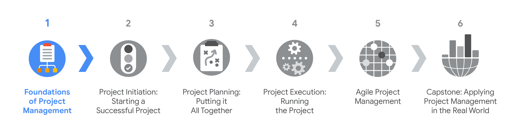
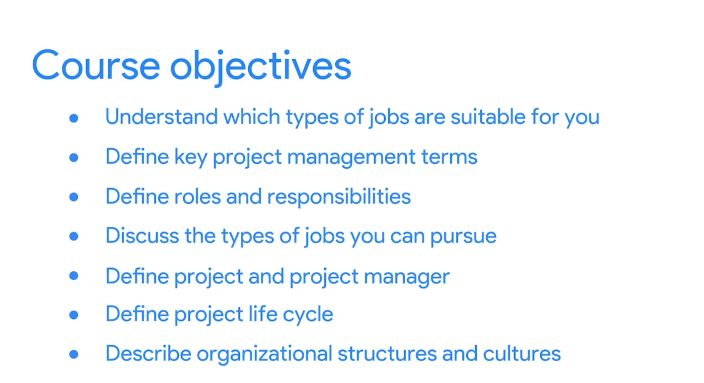

# Foundations of Project Management
The knowledge base contanis a specialization overview from the course [Foundations of Project Management](https://www.coursera.org/learn/project-management-foundations/) by Google on [Coursera](https://www.coursera.org/). It is divided into following modules:
- [Embarking on a career in project management](Embarking%20on%20a%20career%20in%20project%20management.md)
- [Becoming an effective project manager](Becoming%20an%20effective%20project%20manager.md)
- [The project management life cycle and methodologies](The%20project%20management%20life%20cycle%20and%20methodologies.md)
- [Organizational structure and culture](Organizational%20structure%20and%20culture.md)

This course is the first in a series of six to equip you with the skills you need to apply to introductory-level roles in project management. Project managers play a key role in leading, planning and implementing critical projects to help their organizations succeed. In this course, you’ll discover foundational project management terminology and gain a deeper understanding of  the role and responsibilities of a project manager. We’ll also introduce you to the kinds of jobs you might pursue after completing this program. Throughout the program, you’ll learn from current Google project managers, who can provide you with a multi-dimensional educational experience that will help you build your skills  for on-the-job application. 

Learners who complete this program should be equipped to apply for introductory-level jobs as project managers. No previous experience is necessary.

By the end of this course, you will be able to:
- Define project management and describe what constitutes a project.
- Explore project management roles and responsibilities across a variety of industries.
- Detail the core skills that help a project manager be successful.
- Describe the life cycle of a project and explain the significance of each phase.
- Compare different program management methodologies and approaches and determine which is most effective for a given project.
- Define organizational structure and culture and explain how it impacts project management. 
- Define change management and describe the role of the project manager in the process.

[Here](https://www.coursera.org/account/accomplishments/verify/WEL8AUCN7ABG) is my certification for this first course.

## Certification Overview
###  Google Project Management Certification
**Project managers** are natural problem-solvers. They set the plan and guide teammates, and manage changes, risks, and stakeholders. This [Google Project Management: Professional Certificate](https://www.coursera.org/professional-certificates/google-project-management) includes over 140 hours of instruction and hundreds of practice-based assessments which will help you simulate real-world project management scenarios that are critical for success in the workplace. The content is highly interactive and exclusively developed by Google employees with decades of experience in program and project management.

**Skills you’ll gain will include**: Creating risk management plans; Understanding process improvement techniques; Managing escalations, team dynamics, and stakeholders; Creating budgets and navigating procurement; Utilizing  project management software, tools, and templates; Practicing Agile project management, with an emphasis on Scrum.

Through a mix of videos, assessments, and hands-on activities, you’ll get introduced to initiating, planning, and running both traditional and Agile projects. You’ll develop a toolbox to demonstrate your understanding of key project management elements, including managing a schedule, budget, and team.

### Certification Content

The [Google Project Management: Professional Certificate](https://www.coursera.org/professional-certificates/google-project-management) contains six courses.

- **Foundations of Project Management**
- Project Initiation: Starting a Successful Project
- Project Planning: Putting It All Together
- Project Execution: Running the Project
- Agile Project Management
- Capstone: Applying Project Management in the Real World

Most of the content is from the course itself. © Google and Coursera.