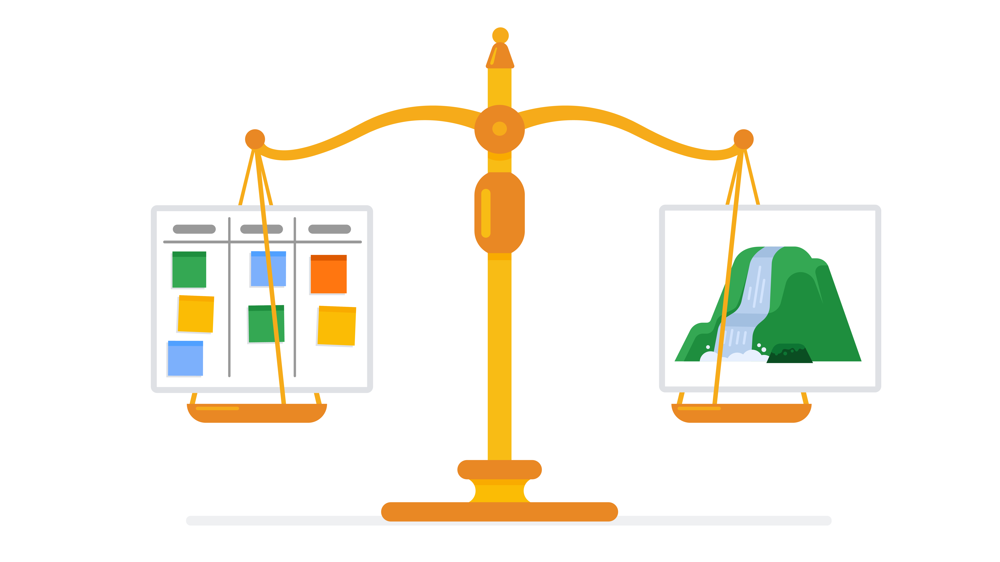

# The project management life cycle and methodologies
The project life cycle is the path for your project from start to finish. Each project phase builds toward the subsequent phase and helps to create a structure for the project. To recap, the main phases of the project life cycle are: initiating the project, making a plan, executing and completing tasks, and closing the project. 

## Project life cycle
### Initiate the project
In this phase, ask questions to help set the foundation for the project, such as:
- Who are the stakeholders?
- What are the client’s or customer’s goals?
- What is the purpose and mission of the project?
- What are the measurable objectives for the team?
- What is the project trying to improve? 
- When does this project need to be completed? 
- What skills and resources will the project require? 
- What will the project cost? What are the benefits?

### Make a plan
In this phase, make a plan to get your project from start to finish. 

- Create a detailed project plan. What are the major milestones? What tasks or deliverables make up each milestone?  
- Build out the schedule so you can properly manage the resources, budget, materials, and timeline. Here, you will create an itemized budget.

### Execute the project
In this phase, put all of your hard work from the first two phases into action. 
- Monitor your project team as they complete project tasks. 
- Break down any barriers that would slow or stop the team from completing tasks. 
- Help keep the team aware of schedule and deliverable expectations.
- Address weaknesses in your process or examine places where your team may need additional training to meet the project’s goals.
- Adapt to changes in the project as they arise.

### Close the project
In this phase, close out the project.
- Identify that your team has completed all of the requested outcomes. 
- Release your team so they can support other projects within the company.
- Take time with your team to celebrate your successes! 
- Pass off all remaining deliverables and get stakeholder approval.
- Document the lessons you and your team learned during the project.
- Reflect on ways to improve in the future.

#### Key takeaway
Each phase of the project life cycle has its own significance and reason for existing. By following the project life cycle, you’re ensuring that you are: 
- Capturing the expectations of your customer
- Setting your project up for success with a plan
- Executing project tasks and addressing any issues that arise 
- Closing out your project to capture any lessons learned 

It may seem like a lot of work to go through an entire project life cycle, but the long-term impact it will have on your project is huge! It is your job as the project manager to make sure that your leadership truly understands the risk of not properly preparing for a project. Making assumptions that are incorrect can put your company at risk. Instead, taking the time to carefully initiate, plan, execute, and close your project leads to project success and good working relationships with customers. 

## Project management methodologies

### Waterfall
- Sequential and linear project management methodology.
- Emphasizes thorough upfront planning and documentation.
- Progress moves through distinct phases: initiation, planning, execution, monitoring/controlling, and closing.
- Changes are difficult to accommodate once the project has started.
- Well-suited for projects with stable requirements and a clear understanding of the end product.

### Agile
- Iterative and flexible project management methodology.
- Prioritizes adaptability and responsiveness to change.
- Work is organized into short, time-boxed iterations or sprints.
- Emphasizes collaboration, customer feedback, and continuous improvement.
- Well-suited for projects with evolving or unclear requirements, fostering rapid and incremental delivery.

In summary, Waterfall follows a linear, planned approach, while Agile embraces flexibility, collaboration, and iterative development. The choice between them often depends on the nature of the project and the level of certainty regarding requirements.

#### Comparing Waterfall and Agile approaches

Waterfall and Agile are implemented in many different ways on many different projects, and some projects may use aspects of each. The chart below briefly describes and compares Waterfall and Agile approaches. It can be used as a quick reference tool, but be aware that in practice, the differences between these two approaches may not always be clearly defined.

|   Waterfall and Agile Comparison            | **Waterfall**                                              | **Agile**                                                    |
|--------------------------------------|--------------------------------------------------------|----------------------------------------------------------|
| Project manager's role               | Project manager serves as an active leader by prioritizing and assigning tasks to team members. | Scrum Master acts primarily as a facilitator, removing any barriers the team faces. Team shares more responsibility in managing their own work. |
| Scope                                | Project deliverables and plans are well-established and documented in the early stages of initiating and planning. Changes go through a formal change request process. | Planning happens in shorter iterations and focuses on delivering value quickly. Subsequent iterations are adjusted in response to feedback or unforeseen issues. |
| Schedule                             | Follows a mostly linear path through the initiating, planning, executing, and closing phases of the project. | Time is organized into phases called Sprints. Each Sprint has a defined duration, with a set list of deliverables planned at the start of the Sprint. |
| Cost                                 | Costs are kept under control by careful estimation up front and close monitoring throughout the life cycle of the project. | Costs and schedule could change with each iteration. |
| Quality                              | Project manager makes plans and clearly defines criteria to measure quality at the beginning of the project. | Team solicits ongoing stakeholder input and user feedback by testing products in the field and regularly implementing improvements. |
| Communication                        | Project manager continually communicates progress toward milestones and other key indicators to stakeholders, ensuring that the project is on track to meet the customer’s expectations. | Team is customer-focused, with consistent communication between users and the project team. |
| Stakeholders                         | Project manager continually manages and monitors stakeholder engagement to ensure the project is on track. | Team frequently provides deliverables to stakeholders throughout the project. Progress toward milestones is dependent upon stakeholder feedback. |

## Popular project management approaches
Below is a brief recap of some of the project management approaches:

- **Waterfall** is a traditional methodology in which tasks and phases are completed in a linear, sequential manner, and each stage of the project must be completed before the next begins. The project manager is responsible for prioritizing and assigning tasks to team members. In Waterfall, the criteria used to measure quality is clearly defined at the beginning of the project.

- **Agile** involves short phases of collaborative, iterative work with frequent testing and regularly-implemented improvements. Some phases and tasks happen at the same time as others. In Agile projects, teams share responsibility for managing their own work. Scrum and Kanban are examples of Agile frameworks, which are specific development approaches based on the Agile philosophy.

- **Scrum** is an Agile framework that focuses on developing, delivering, and sustaining complex projects and products through collaboration, accountability, and an iterative process. Work is completed by small, cross-functional teams led by a Scrum Master and is divided into short Sprints with a set list of deliverables.

- **Kanban** is a tool used in both Agile and Lean approaches that provides visual feedback about the status of the work in progress through the use of Kanban boards or charts. With Kanban, project managers use sticky notes or note cards on a physical or digital Kanban board to represent the team’s tasks with categories like “To do,” “In progress,” and “Done.”

- **Lean** uses the 5S quality tool to eliminate eight areas of waste, save money, improve quality, and streamline processes. Lean’s principles state that you can do more with less by addressing dysfunctions that create waste. Lean implements a Kanban scheduling system to manage production.

- **Six Sigma** involves reducing variations by ensuring that quality processes are followed every time. The Six Sigma method follows a process-improvement approach called DMAIC, which stands for define, measure, analyze, improve, and control.

- **Lean Six Sigma** is a combination of Lean and Six Sigma approaches. It is often used in projects that aim to save money, improve quality, and move through processes quickly. Lean Six Sigma is also ideal for solving complex or high-risk problems. The 5S organization framework, the DMAIC process, and the use of Kanban boards are all components of this approach. 

